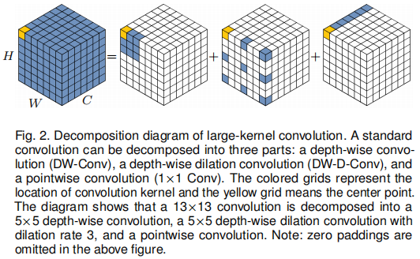
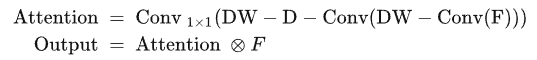
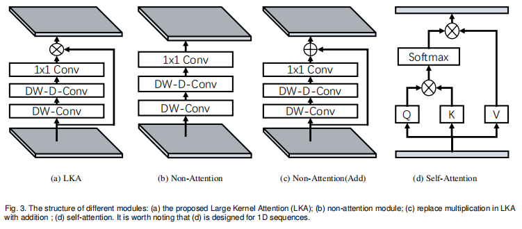
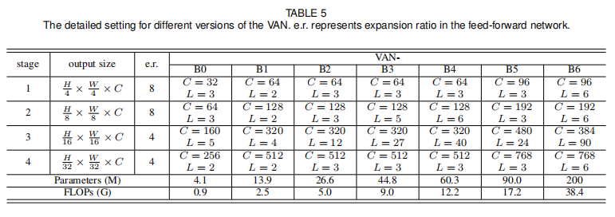

## VAN

> 注：这里面的内容都不用读，来不及的

在这篇论文中，作者提出了一个新的线性注意力机制LKA，和基于LKA的网络结构VAN。

### LKA

> 有两种众所周知的方法可以建立注意力关系。
>
> 1. 第一种是采用自我注意机制来捕捉远程依赖。
> 2. 第二种方法是使用大核卷积建立相关性并生成注意图。这种方式仍然存在明显的缺点。大的内核卷积带来了大量的计算开销和参数，为了克服上述缺点，利用自注意和大核卷积的优点，提出分解一个大核卷积运算来获取远程关系。

如图2所示，一个大的核卷积可以分为三部分

1. 一个空间局部卷积(depth-wise的卷积)
2. 一个空间远程卷积(depth-wise的空洞卷积)
3. 一个通道卷积(1 × 1卷积)

通过上述分解，可以用少量的计算成本和参数捕捉长期关系。在获得长期关系后，可以估计一个点的重要性并生成注意图。



如图3(a)所示，LKA 模块可以写为






> 1. LKA 结合了卷积和自注意的优点。它综合考虑了局部语境信息、大的接受域和动态过程。
> 2. LKA 不仅在空间维度上实现了适应性，而且在通道维度上也实现了适应性。值得注意的是，在深度神经网络中，不同的通道往往代表不同的对象，通道维度的适应性对视觉任务也很重要

### VAN

VAN有一个四级序列，输出空间分辨率逐渐降低，分别是h4×w4、h8×w8、h16×w16和h32×w32。

随着分辨率的降低，输出通道的数量也在增加。

如图3（d）所示的单一阶段，首先对输入进行下采样（使用stride来控制下采样率）。下采样后，一个阶段中的所有其他层保持相同的输出大小。具体结构参数如table 2所示



> 默认情况下，LKA采用
>
> 1. 5×5depth-wise卷积
> 2. 膨胀系数为3的7×7depth-wise卷积
> 3. 以及1×1卷积来近似21×21卷积。在此设置下，VAN可以有效地实现本地信息和远程连接。

### 改进

作者在论文中提到了以下的改进思路：应用大核、引入多尺度结构和使用多分支结构。

#### 1. 大核

针对LKA模型的`conv0`层进行相应的修改，这里尝试将kernel_size改为7*7，stride = 1，padding  = 3

```python
class LKA(nn.Module):
    def __init__(self, dim):
        super().__init__()
        self.conv0 = nn.Conv2d(dim, dim, kernel_size=(7, 7), stride=(1, 1), padding=(3, 3), groups=dim)
        self.conv_spatial = nn.Conv2d(dim, dim, kernel_size=(1, 1), stride=(1, 1))
        self.conv1 = nn.Conv2d(dim, dim, kernel_size=(1, 1), stride=(1, 1))

    def forward(self, x):
        u = x.clone()
        attn = self.conv0(x)
        attn = self.conv_spatial(attn)
        attn = self.conv1(attn)

        return u * attn
```

#### 2. 多尺度分支

引入了`MultiScaleBranch`类作为多尺度分支结构，用于处理不同尺度的特征。`MultiScaleBranch`类包含三个不同尺寸的卷积核（3x3、5x5、7x7），它们分别对输入进行卷积操作，然后将结果进行拼接。

在`LKA`类的`forward`方法中，使用了`MultiScaleBranch`作为`conv_spatial`的替代，这样就引入了多尺度结构。在模型最后一层的卷积操作中，将多尺度分支的输出与原始输入进行拼接，以增强模型的表示能力。

```python
class MultiScaleBranch(nn.Module):
    def __init__(self, dim):
        super().__init__()
        self.conv3x3 = nn.Conv2d(dim, dim, kernel_size=3, padding=1)
        self.conv5x5 = nn.Conv2d(dim, dim, kernel_size=5, padding=2)
        self.conv7x7 = nn.Conv2d(dim, dim, kernel_size=7, padding=3)

    def forward(self, x):
        out_3x3 = self.conv3x3(x)
        out_5x5 = self.conv5x5(x)
        out_7x7 = self.conv7x7(x)
        return torch.cat([out_3x3, out_5x5, out_7x7], dim=1)


class LKA(nn.Module):
    def __init__(self, dim):
        super().__init__()
        self.conv0 = nn.Conv2d(dim, dim, kernel_size=5, padding=2, groups=dim)
        self.conv_spatial = MultiScaleBranch(dim)
        self.conv1 = nn.Conv2d(dim * 3, dim, kernel_size=1)

    def forward(self, x):
        u = x.clone()
        attn = self.conv0(x)
        attn = F.relu(attn)
        attn = self.conv_spatial(attn)
        attn = F.relu(attn)
        attn = self.conv1(attn)

        return u * attn
```

> 下面的改进思路有时间就读一下，没时间就算了（稍微提一嘴能说完）。

#### 3. 其他改进思路：

1. 增加批归一化层（Batch Normalization）：在卷积层之后添加批归一化层可以帮助加速模型的收敛并提高模型的泛化能力。可以在每个卷积层后添加nn.BatchNorm2d()层，并在forward()函数中应用。
2. 添加非线性激活函数：在卷积层之后添加非线性激活函数可以引入非线性特征映射，提高模型的表示能力。可以在每个卷积层之后使用激活函数，例如ReLU。